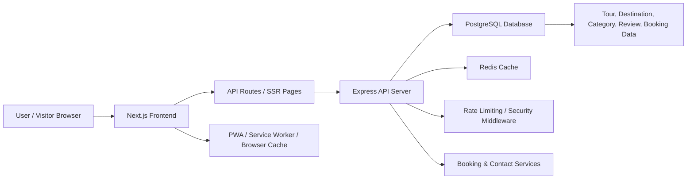
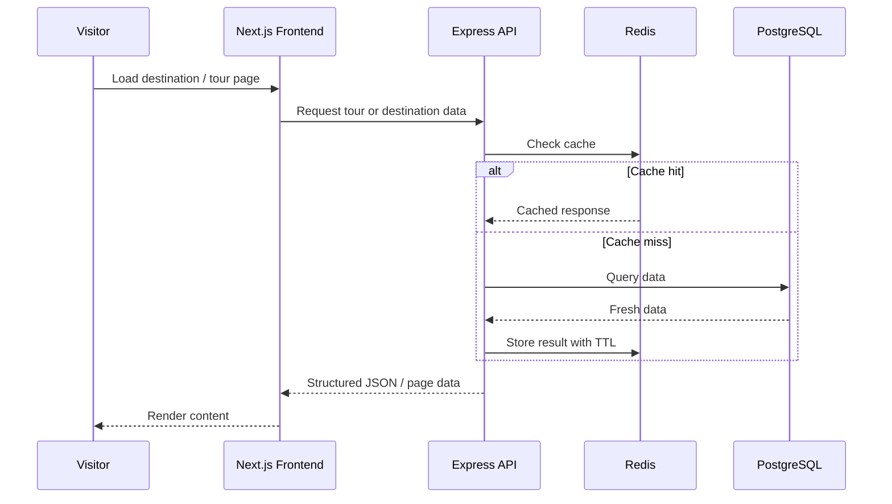
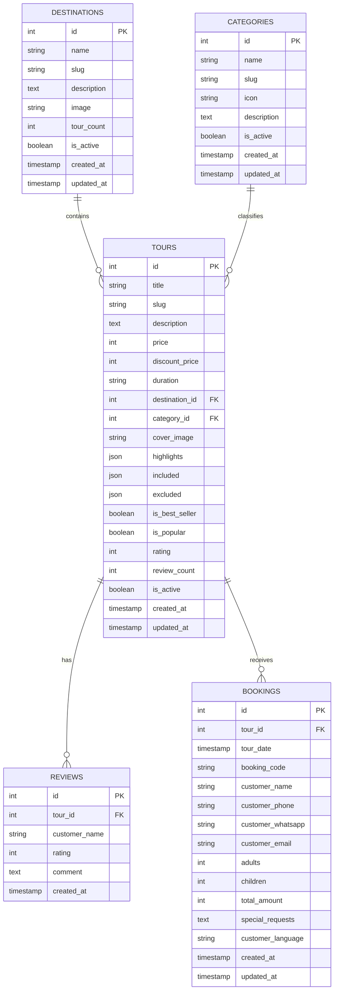
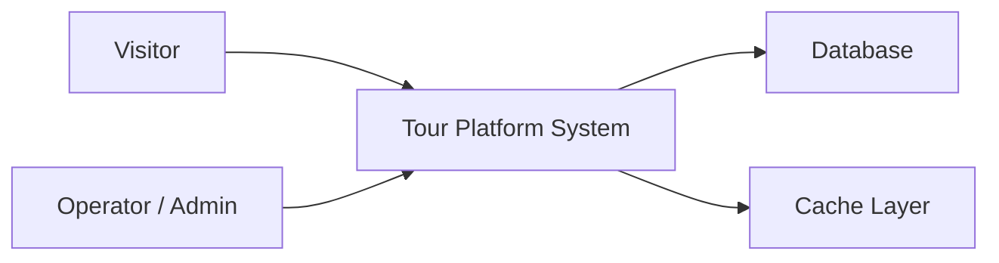
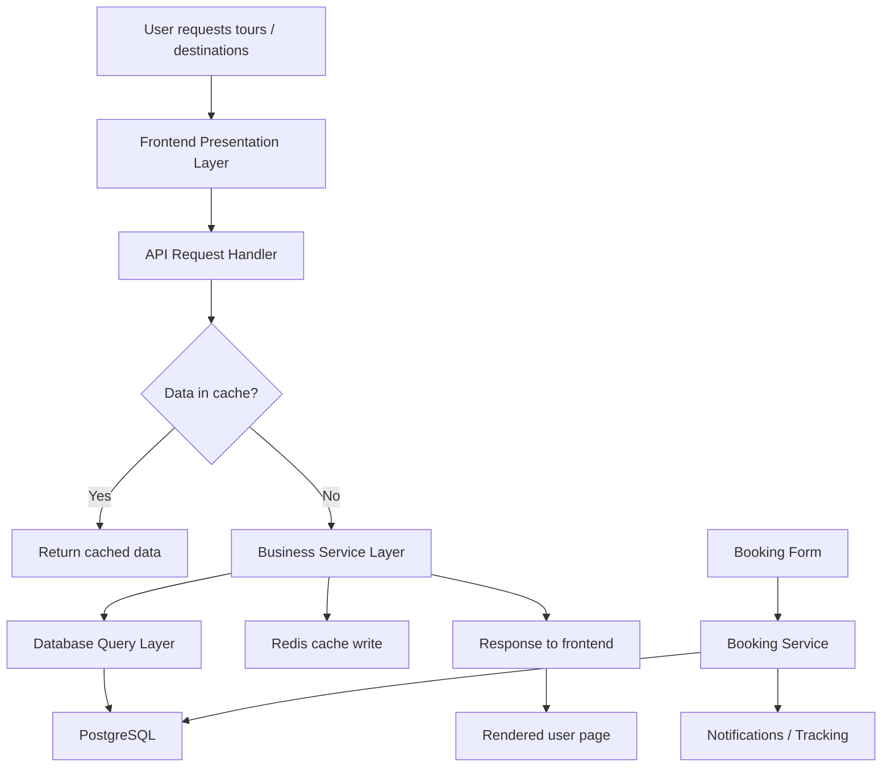
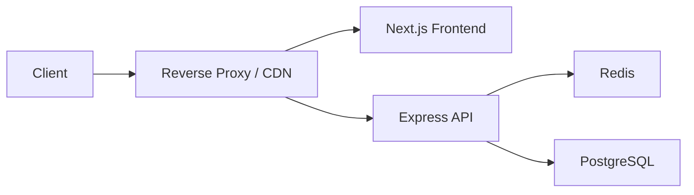
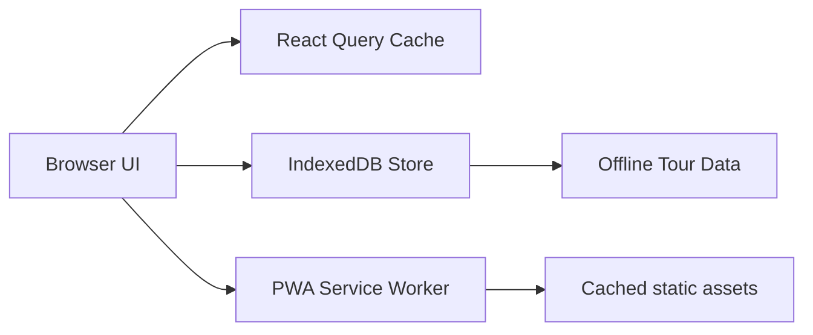
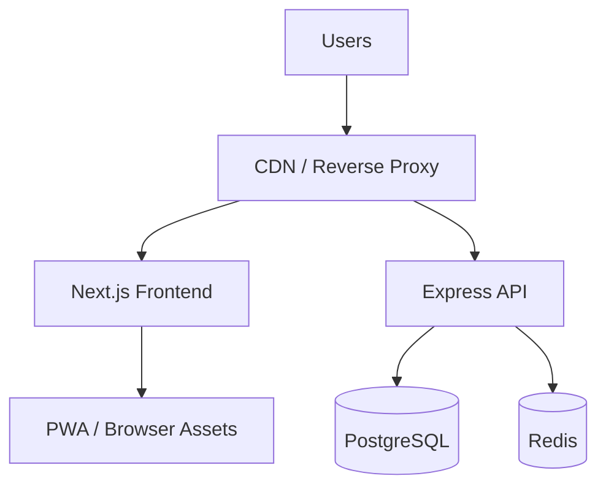

# ETCGO TOURS WEB APP

## Executive Summary

This project is a tourism and travel booking platform focused on showcasing Egyptian destinations, tours, categories, reviews, and booking flows. The system combines a modern marketing website with a structured API backend and a PostgreSQL data layer. It is designed to support high-traffic browsing, caching for performance, secure API access, and offline-friendly access through Progressive Web App (PWA) patterns.

The solution is organized into two main layers:

- Frontend: Next.js marketing website and customer-facing portal
- Backend: Express API with PostgreSQL + Drizzle ORM + Redis cache

This repository is structured to support both customer experience and operational efficiency, while remaining scalable for future growth.

---

## 1. Project Architecture

### High-Level Architecture



### Architectural Principles

- Separation of concerns between presentation, API, and data layers
- SSR-first experience for SEO and content discovery
- API-first backend for structured business operations
- Redis-based performance caching for repetitive read operations
- PWA approach to improve mobile usability and offline experience
- Security controls including CORS, Helmet, request validation, rate limiting, and API-key checks

---

## 2. System Architecture

### Frontend Layer

Technology stack:

- Next.js 16
- React 18
- TypeScript
- Tailwind CSS
- TanStack Query for client-side caching and async data orchestration
- Framer Motion / GSAP for rich user experience
- PWA support through `@ducanh2912/next-pwa`

Responsibilities:

- Render tourism pages, destination details, tour listings, blog content, and booking interfaces
- Fetch data from the backend or internal Next.js API routes
- Cache query results in memory for repeated access
- Optimize image delivery and SEO metadata
- Support mobile-first performance and offline browsing

### Backend Layer

Technology stack:

- Express.js
- TypeScript
- PostgreSQL
- Drizzle ORM
- Redis
- Winston logging
- Rate limiting middleware

Responsibilities:

- Secure and structured API layer for tours, destinations, categories, reviews, bookings, and contact requests
- Database abstraction with typed models and service layers
- Cache-aware retrieval paths for common reads
- Alerting and operational monitoring hooks
- Robust request validation and access control

### Data Layer

- PostgreSQL stores the canonical business data
- Drizzle ORM maps relational schema with typed objects and queries
- Redis sits in front of hot data paths to minimize database load
- Schema includes `tours`, `destinations`, `categories`, `reviews`, and `bookings`

---

## 3. System Design

### Functional Design

The platform supports the following major flows:

1. Visitor browses destinations and tours
2. Visitor selects a tour and reads details, pricing, and reviews
3. Visitor submits a booking request or contact form
4. Backend validates, stores, and notifies operational teams
5. Cached tour or destination data is served quickly for repeated public reads

### Non-Functional Design

- Performance: Redis and browser cache reduce repeated database access
- Scalability: backend services are separated by business domain
- Availability: cache fallback protects the public experience if upstream calls are slow
- Maintainability: code is divided into routes, services, models, middleware, and utilities
- Security: Helmet, rate limiting, CORS, API keys, input sanitization

### Runtime Flow



---

## 4. Entity Relationship Diagram (ERD)

The business model is centered around tours and destinations, with categories and reviews attached to the travel catalog.



### Relationship Notes

- A destination can have many tours.
- A category can include many tours.
- Each tour can have many reviews.
- A booking belongs to one tour.
- Each entity is designed for query performance, filtering, and future reporting.

---

## 5. Data Flow Diagram (DFD)

### Level 0: Context Diagram



### Level 1: Key Processes



---

## 6. Dependency Injection and Service Composition

This project does not use a formal enterprise DI container such as NestJS or Spring. Instead, it follows a lightweight dependency-oriented design using layered composition:

### Example Pattern

- Route files define HTTP endpoints
- Services provide business logic
- Models handle database access
- Config and cache modules are injected by import and singleton usage

### Real examples from this project

- `server/src/routes/index.ts` composes all route modules
- `server/src/services/tours.service.ts` uses `ToursModel` and `toursCache`
- `server/src/config/redis.ts` exposes a singleton Redis client
- `server/src/config/index.ts` centralizes environment configuration

This design keeps the system modular and easy to extend while preserving low complexity.

### Why this works well

- Business logic remains separate from HTTP handlers
- Shared infrastructure is reused consistently
- Testing is easier because logic is isolated behind service boundaries
- Adding new domains such as hotels, transfers, or packages is straightforward

---

## 7. Reverse Proxy and Production Edge Layer

The project is designed to be served behind a reverse proxy in production, typically using Nginx, Cloudflare, or a managed load balancer.

 deployment model:



### Typical benefits of the reverse proxy layer

- SSL termination and HTTPS enforcement
- Request routing between frontend and API
- Load balancing and traffic control
- Static asset caching and compression
- Protection against abusive traffic and origin misuse

### Current repo signal

This repository contains production-focused security and caching rules such as:

- CORS configuration
- Helmet middleware
- compression middleware
- cache-control headers in Next.js config
- rate limiting on API routes

This is consistent with a deployment model where a reverse proxy sits in front of the application stack.

---

## 8. Caching Strategy

The project uses multiple caching layers to improve speed and reduce database pressure.

### 8.1 Redis Caching (Server-side)

Redis is used for read-heavy application data and is a core performance layer.

Examples in the project:

- `server/src/config/redis.ts`
- `server/src/utils/cache.service.ts`
- `server/src/routes/api/destinations.route.ts`
- `server/src/routes/api/tours.route.ts`
- `server/src/services/tours.service.ts`

Observed TTL patterns:

- 5 minutes for frequent list queries
- 10 minutes for destination or detail content
- cache invalidation routes exist for maintenance and refresh actions

### 8.2 TanStack Query / React Query (Client-side)

The frontend uses React Query to reduce unnecessary network calls and keep UI data fresh without excessive refetching.

Observed patterns:

- `staleTime` for data freshness control
- `gcTime` for memory retention
- `refetchOnWindowFocus: false`
- disabled mounting refetch for smoother user experience

### 8.3 Next.js / PWA Cache

The frontend is configured with PWA features and static asset caching:

- `client/next.config.ts`
- `client/public/sw.js`
- `@ducanh2912/next-pwa`

This provides:

- better offline support
- faster retry on connectivity recovery
- cached navigation and static asset reuse

### 8.4 HTTP Cache Headers

The app sets response headers for static files and public pages to benefit from browser and CDN caching.

Examples:

- static assets: long immutable cache lifetime
- page responses: max-age and stale-while-revalidate patterns

---

## 9. IndexedDB and Offline Persistence

### Current Implementation Status

This repository does not currently contain a dedicated custom IndexedDB layer for application data persistence. The project instead relies on:

- browser caching
- service worker/PWA caching
- React Query in-memory caching
- Redis server-side caching for API responses

###  Future Extension

For a stronger offline-first tourism experience, the platform can add IndexedDB to persist:

- recently viewed tours
- favorite or saved destinations
- booking drafts
- local translation cache
- offline tour cards and notes

### Practical architecture recommendation



This would complement the current architecture without replacing Redis as the server-side cache.

---

## 10. Security and Reliability

Key infrastructure protections currently present in the codebase:

- `helmet()` for HTTP hardening
- `cors()` with allowlist validation
- `express-rate-limit` for API protection
- `mongo-sanitize` to reduce NoSQL injection risk
- request logging middleware
- environment-based configuration validation
- structured error handling middleware

These measures are important for a public tourism platform that handles booking and contact submissions.

---

## 11. Repository Structure

```text
nextjs-egy-tour/
├── client/                  # Next.js frontend
│   ├── src/
│   ├── public/
│   ├── next.config.ts
│   └── package.json
├── server/                 # Express + Drizzle API
│   ├── src/
│   ├── drizzle/
│   ├── migrations/
│   └── package.json
├── reports/                # Reporting and project artifacts
├── package.json            # Root workspace coordination
├── README.md               # Project documentation
└── .github/
```

---

## 12. Suggested Deployment Topology



This design supports SEO, public marketing content, and transactional customer journeys while keeping performance and reliability in focus.

---

## 13. Summary for HR / Stakeholder Review

This project is a full-stack tourism platform designed for customer acquisition and booking conversion. It combines modern digital experience design with a scalable backend architecture, strong caching strategy, and production-readiness patterns. The system is structured for:

- public browsing and SEO
- mobile-friendly experience
- booking operations
- business reporting and future expansion
- secure and resilient production deployment

The architecture aligns with a modern web product model: customer-facing frontend, service-backed API, relational database, and high-performance cache layer.

---


## 14 Conclusion

This repository is not just a landing page; it is a structured digital tourism platform with a clear architectural foundation and a scalable service pattern. The project demonstrates good separation between frontend, API, and data layers while introducing production-aware patterns such as caching, reverse proxy readiness, and security middleware.

It is well suited for stakeholder review, internal architecture communication, and future team scaling.
